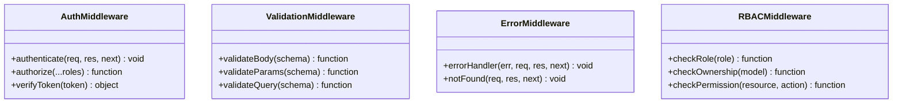
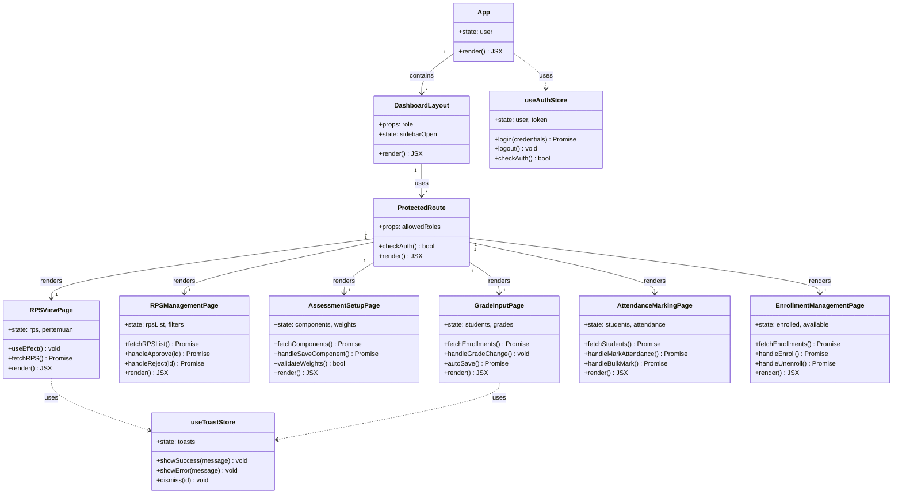

# Class Diagram

**RPS Management System - Object-Oriented Structure**  
**Last Updated:** 2026-02-04  
**Backend:** Node.js + Express + Sequelize  
**Frontend:** React + Vite

---

## 📦 Backend Class Diagram (Sequelize Models)

```mermaid
classDiagram
    %% ========== USER & AUTH ==========
    
    class User {
        +int id
        +string name
        +string email
        +string password
        +enum role
        +Date createdAt
        +Date updatedAt
        +authenticate(password) bool
        +generateToken() string
    }
    
    %% ========== ORGANIZATIONAL ==========
    
    class Fakultas {
        +int id
        +string kode_fakultas
        +string nama_fakultas
        +Date createdAt
        +Date updatedAt
        +getProdi() Prodi[]
    }
    
    class Prodi {
        +int id
        +int fakultas_id
        +string kode_prodi
        +string nama_prodi
        +enum jenjang
        +Date createdAt
        +Date updatedAt
        +getMahasiswa() Mahasiswa[]
        +getDosen() Dosen[]
        +getMataKuliah() MataKuliah[]
        +getCPL() CPL[]
    }
    
    class Mahasiswa {
        +int id
        +int user_id
        +int prodi_id
        +string npm
        +string nama
        +string email
        +string angkatan
        +Date createdAt
        +Date updatedAt
        +getEnrollments() Enrollment[]
        +getGrades() StudentGrade[]
        +getAttendance() Attendance[]
    }
    
    class Dosen {
        +int id
        +int user_id
        +int prodi_id
        +string nidn
        +string nama
        +string email
        +Date createdAt
        +Date updatedAt
        +getRPS() RPS[]
        +getAssignedCourses() MataKuliah[]
    }
    
    %% ========== CURRICULUM ==========
    
    class CPL {
        <<Capaian Pembelajaran Lulusan>>
        +int id
        +int prodi_id
        +string kode
        +text deskripsi
        +enum kategori
        +Date createdAt
        +Date updatedAt
        +getCPMK() CPMK[]
    }
    
    class CPMK {
        <<Capaian Pembelajaran Mata Kuliah>>
        +int id
        +int cpl_id
        +string kode
        +text deskripsi
        +Date createdAt
        +Date updatedAt
        +getSubCPMK() SubCPMK[]
    }
    
    class SubCPMK {
        +int id
        +int cpmk_id
        +string kode
        +text deskripsi
        +Date createdAt
        +Date updatedAt
        +getPertemuan() RPSPertemuan[]
        +getAssessments() AssessmentComponent[]
    }
    
    %% ========== COURSE & RPS ==========
    
    class MataKuliah {
        +int id
        +int prodi_id
        +string kode_mk
        +string nama_mk
        +int sks
        +int semester
        +enum jenis
        +Date createdAt
        +Date updatedAt
        +getRPS() RPS[]
        +getEnrollments() Enrollment[]
        +getAssessments() AssessmentComponent[]
    }
    
    class RPS {
        <<Rencana Pembelajaran Semester>>
        +int id
        +int mata_kuliah_id
        +string semester
        +string tahun_ajaran
        +int dosen_pengampu_id
        +text deskripsi_mk
        +enum status
        +Date submitted_at
        +int reviewed_by
        +Date reviewed_at
        +text review_notes
        +Date createdAt
        +Date updatedAt
        +getPertemuan() RPSPertemuan[]
        +getPenilaian() PenilaianMK[]
        +submit() void
        +approve(userId) void
        +reject(userId, notes) void
    }
    
    class RPSPertemuan {
        +int id
        +int rps_id
        +int pertemuan_ke
        +Date tanggal
        +text topik
        +int sub_cpmk_id
        +text metode_pembelajaran
        +text materi
        +text bentuk_evaluasi
        +Date createdAt
        +Date updatedAt
        +getAttendance() Attendance[]
    }
    
    class PenilaianMK {
        +int id
        +int rps_id
        +string komponen
        +decimal bobot
        +text kriteria
        +Date createdAt
        +Date updatedAt
        +validateWeight() bool
    }
    
    %% ========== GRADING SYSTEM ==========
    
    class GradingSystem {
        +int id
        +int prodi_id
        +string semester
        +string tahun_ajaran
        +enum grading_mode
        +int grade_scale_id
        +Date createdAt
        +Date updatedAt
        +getGradeScale() GradeScale
        +isLegacy() bool
        +isOBE() bool
    }
    
    class GradeScale {
        +int id
        +string scale_name
        +text description
        +Date createdAt
        +Date updatedAt
        +getDetails() GradeScaleDetail[]
        +convertToLetter(angka) string
        +convertToIP(angka) decimal
    }
    
    class GradeScaleDetail {
        +int id
        +int grade_scale_id
        +string nilai_huruf
        +decimal nilai_angka_min
        +decimal nilai_angka_max
        +decimal nilai_ip
        +Date createdAt
        +Date updatedAt
        +matches(angka) bool
    }
    
    class AssessmentComponent {
        +int id
        +int mata_kuliah_id
        +string semester
        +string tahun_ajaran
        +enum component_type
        +string legacy_name
        +decimal legacy_weight
        +int sub_cpmk_id
        +string pertemuan_range
        +decimal obe_weight
        +Date createdAt
        +Date updatedAt
        +getStudentGrades() StudentGrade[]
        +getWeight() decimal
        +isLegacy() bool
        +isOBE() bool
    }
    
    class StudentGrade {
        +int id
        +int mahasiswa_id
        +int mata_kuliah_id
        +int assessment_component_id
        +decimal nilai_angka
        +string nilai_huruf
        +decimal nilai_ip
        +int graded_by
        +Date graded_at
        +Date createdAt
        +Date updatedAt
        +autoConvert() void
        +calculateWeighted(weight) decimal
    }
    
    class FinalGrade {
        +int id
        +int mahasiswa_id
        +int mata_kuliah_id
        +string semester
        +string tahun_ajaran
        +int grading_system_id
        +decimal nilai_angka
        +string nilai_huruf
        +decimal nilai_ip
        +enum status
        +int approved_by
        +Date approved_at
        +Date createdAt
        +Date updatedAt
        +calculate() void
        +approve(userId) void
    }

    class AcademicYear {
        +int id
        +string name
        +bool is_active
        +enum active_semester
        +Date createdAt
        +Date updatedAt
        +setCurrent() Promise
    }

    class Notification {
        +int id
        +int user_id
        +string title
        +text message
        +enum type
        +bool is_read
        +string link
        +Date createdAt
        +markAsRead() Promise
    }
    
    %% ========== ATTENDANCE ==========
    
    class Attendance {
        +int id
        +int mahasiswa_id
        +int rps_pertemuan_id
        +enum status
        +text notes
        +int marked_by
        +Date marked_at
        +Date createdAt
        +Date updatedAt
        +isPresent() bool
        +isExcused() bool
    }
    
    %% ========== ENROLLMENT ==========
    
    class Enrollment {
        +int id
        +int mahasiswa_id
        +int mata_kuliah_id
        +string semester
        +string tahun_ajaran
        +enum status
        +Date enrolled_at
        +Date dropped_at
        +string final_grade
        +decimal final_ip
        +Date createdAt
        +Date updatedAt
        +isActive() bool
        +drop() void
        +complete(grade, ip) void
    }
    
    %% ========== RELATIONSHIPS ==========
    
    User "1" --> "0..1" Mahasiswa : has profile
    User "1" --> "0..1" Dosen : has profile
    User "1" --> "*" Notification : receives
    
    Fakultas "1" --> "*" Prodi : contains
    
    Prodi "1" --> "*" Mahasiswa : enrolls
    Prodi "1" --> "*" Dosen : employs
    Prodi "1" --> "*" MataKuliah : offers
    Prodi "1" --> "*" CPL : defines
    Prodi "1" --> "*" GradingSystem : configures
    
    CPL "1" --> "*" CPMK : contains
    CPMK "1" --> "*" SubCPMK : contains
    
    MataKuliah "1" --> "*" RPS : has plans
    MataKuliah "1" --> "*" Enrollment : has enrollments
    MataKuliah "1" --> "*" AssessmentComponent : has assessments
    
    Dosen "1" --> "*" RPS : teaches
    
    RPS "1" --> "*" RPSPertemuan : schedules
    RPS "1" --> "*" PenilaianMK : defines
    
    RPSPertemuan "*" --> "1" SubCPMK : targets
    RPSPertemuan "1" --> "*" Attendance : tracks
    
    GradingSystem "*" --> "1" GradeScale : uses
    GradeScale "1" --> "*" GradeScaleDetail : defines
    
    AssessmentComponent "*" --> "0..1" SubCPMK : assesses
    AssessmentComponent "1" --> "*" StudentGrade : has scores
    
    Mahasiswa "1" --> "*" StudentGrade : receives
    Mahasiswa "1" --> "*" FinalGrade : has finals
    Mahasiswa "1" --> "*" Attendance : attends
    Mahasiswa "1" --> "*" Enrollment : registers
    
    Enrollment "*" --> "1" MataKuliah : for course
    Enrollment "*" --> "1" Mahasiswa : by student
```



---

## 🎯 Controller Classes (Business Logic)

```mermaid
classDiagram
    %% ========== BASE CONTROLLER ==========
    
    class BaseController {
        <<abstract>>
        #handleError(res, error) void
        #validateRequest(req, rules) bool
        #getPagination(req) object
    }
    
    %% ========== CONTROLLERS ==========
    
    class AuthController {
        +login(req, res) Promise
        +register(req, res) Promise
        +getMe(req, res) Promise
        +logout(req, res) Promise
    }
    
    class RPSController {
        +getAllRPS(req, res) Promise
        +getRPSById(req, res) Promise
        +createRPS(req, res) Promise
        +updateRPS(req, res) Promise
        +submitRPS(req, res) Promise
        +approveRPS(req, res) Promise
        +rejectRPS(req, res) Promise
        +deleteRPS(req, res) Promise
    }
    
    class RPSDosenController {
        +getCurriculumTree(req, res) Promise
        +getDosenCourses(req, res) Promise
        +createRPS(req, res) Promise
        +updateRPS(req, res) Promise
        +bulkUpsertPertemuan(req, res) Promise
    }
    
    class GradingConfigController {
        +getGradingConfig(req, res) Promise
        +setGradingConfig(req, res) Promise
        +getGradeScales(req, res) Promise
        +convertGrade(angka, scaleId) object
    }
    
    class AssessmentComponentController {
        +getComponents(req, res) Promise
        +createComponent(req, res) Promise
        +updateComponent(req, res) Promise
        +deleteComponent(req, res) Promise
        +validateWeights(req, res) Promise
    }
    
    class StudentGradeController {
        +getGrades(req, res) Promise
        +inputGrade(req, res) Promise
        +batchInputGrades(req, res) Promise
        +calculateFinalGrade(req, res) Promise
        +getFinalGrades(req, res) Promise
        +approveFinalGrade(req, res) Promise
    }
    
    class AttendanceController {
        +getPertemuanAttendance(req, res) Promise
        +markAttendance(req, res) Promise
        +bulkMarkAttendance(req, res) Promise
        +getStudentReport(req, res) Promise
        +getCourseReport(req, res) Promise
    }
    
    class EnrollmentController {
        +getCourseEnrollments(req, res) Promise
        +getStudentEnrollments(req, res) Promise
        +enrollStudents(req, res) Promise
        +unenrollStudent(req, res) Promise
        +bulkEnrollFromCSV(req, res) Promise
        +getEnrollmentStats(req, res) Promise
    }
    
    BaseController <|-- AuthController
    BaseController <|-- RPSController
    BaseController <|-- RPSDosenController
    BaseController <|-- GradingConfigController
    BaseController <|-- AssessmentComponentController
    BaseController <|-- StudentGradeController
    BaseController <|-- AttendanceController
    BaseController <|-- EnrollmentController
```



---

## 🔧 Middleware Classes



---

## 🎨 Frontend Component Hierarchy



---

## 📊 Design Patterns Used

### Backend Patterns

| Pattern | Usage | Example |
|---------|-------|---------|
| **MVC** | Architecture | Models, Controllers, Routes |
| **Repository** | Data access | Sequelize models |
| **Middleware** | Request pipeline | auth, validation, error handling |
| **Factory** | Object creation | Model associations |
| **Strategy** | Grading modes | Legacy vs OBE grading |
| **Observer** | Events | Model hooks (beforeCreate, etc.) |

### Frontend Patterns

| Pattern | Usage | Example |
|---------|-------|---------|
| **Component** | UI building blocks | React components |
| **Container/Presenter** | Logic separation | Pages vs components |
| **HOC** | Component wrapping | ProtectedRoute |
| **Hooks** | State management | useState, useEffect, custom hooks |
| **Store** | Global state | useAuthStore (Zustand) |

---

## 🏗️ Architectural Layers

```
┌─────────────────────────────────────┐
│         FRONTEND (React)            │
│  ┌─────────────────────────────┐   │
│  │  Components & Pages         │   │
│  └─────────────────────────────┘   │
│  ┌─────────────────────────────┐   │
│  │  Stores (Zustand)           │   │
│  └─────────────────────────────┘   │
│  ┌─────────────────────────────┐   │
│  │  API Client (Axios)         │   │
│  └─────────────────────────────┘   │
└─────────────────────────────────────┘
              ↕ HTTP/REST
┌─────────────────────────────────────┐
│         BACKEND (Express)           │
│  ┌─────────────────────────────┐   │
│  │  Routes (API Endpoints)     │   │
│  └─────────────────────────────┘   │
│  ┌─────────────────────────────┐   │
│  │  Middleware (Auth, RBAC)    │   │
│  └─────────────────────────────┘   │
│  ┌─────────────────────────────┐   │
│  │  Controllers (Logic)        │   │
│  └─────────────────────────────┘   │
│  ┌─────────────────────────────┐   │
│  │  Models (Sequelize ORM)     │   │
│  └─────────────────────────────┘   │
└─────────────────────────────────────┘
              ↕ SQL
┌─────────────────────────────────────┐
│       DATABASE (PostgreSQL)         │
└─────────────────────────────────────┘
```

---

**Diagram Generated:** 2026-02-04  
**Total Model Classes:** 21  
**Total Controller Classes:** 8  
**Total Frontend Pages:** 6+  
**Design Patterns:** 12+
