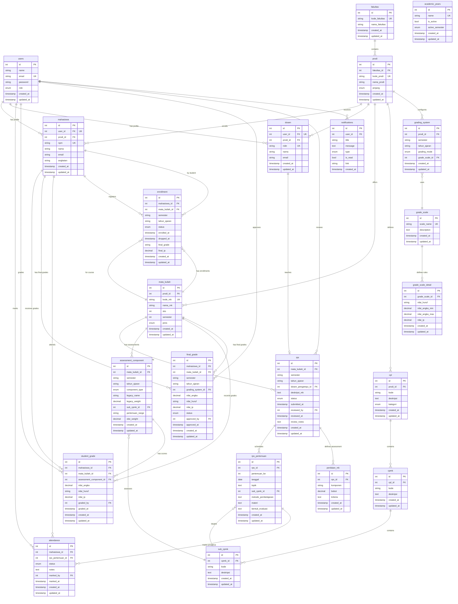

# Entity Relationship Diagram (ERD)

**RPS Management System - Complete Database Relationships**  
**Last Updated:** 2026-02-04  
**Database:** PostgreSQL  
**ORM:** Sequelize

---

## 📊 Full ERD (Mermaid Diagram)



---

## 🔗 Relationship Summary

### One-to-Many Relationships

| Parent | Child | Relationship | Cardinality |
|--------|-------|--------------|-------------|
| **Fakultas** | Prodi | contains | 1:N |
| **Prodi** | Mahasiswa | enrolls | 1:N |
| **Prodi** | Dosen | employs | 1:N |
| **Prodi** | Mata Kuliah | offers | 1:N |
| **Prodi** | CPL | defines | 1:N |
| **Prodi** | Grading System | configures | 1:N |
| **CPL** | CPMK | contains | 1:N |
| **CPMK** | Sub-CPMK | contains | 1:N |
| **Mata Kuliah** | RPS | has plans | 1:N |
| **Mata Kuliah** | Enrollment | has enrollments | 1:N |
| **Mata Kuliah** | Assessment Component | has assessments | 1:N |
| **RPS** | RPS Pertemuan | schedules | 1:N |
| **RPS** | Penilaian MK | defines assessment | 1:N |
| **RPS Pertemuan** | Attendance | tracks presence | 1:N |
| **Grade Scale** | Grade Scale Detail | defines rules | 1:N |
| **Assessment Component** | Student Grade | has scores | 1:N |
| **Mahasiswa** | Student Grade | receives grades | 1:N |
| **Mahasiswa** | Final Grade | has final grades | 1:N |
| **Mahasiswa** | Attendance | attends | 1:N |
| **Mahasiswa** | Enrollment | registers | 1:N |

### Many-to-One Relationships

| Child | Parent | Purpose |
|-------|--------|---------|
| **Mahasiswa** | User | authentication profile |
| **Dosen** | User | authentication profile |
| **RPS** | Dosen | lecturer assignment |
| **Grading System** | Grade Scale | grade conversion |
| **RPS Pertemuan** | Sub-CPMK | learning outcome target |
| **Assessment Component** | Sub-CPMK | OBE assessment |
| **Enrollment** | Mahasiswa | student registration |
| **Enrollment** | Mata Kuliah | course registration |

### Self-Referencing Relationships

| Table | Reference | Purpose |
|-------|-----------|---------|
| **RPS** | User (reviewed_by) | approval workflow |
| **Student Grade** | User (graded_by) | grading audit |
| **Final Grade** | User (approved_by) | approval workflow |
| **Attendance** | User (marked_by) | attendance audit |

---

## 📝 Cardinality Notation

```
||--o{ : One-to-Many (1:N)
}o--|| : Many-to-One (N:1)
||--|| : One-to-One (1:1)
}o--o{ : Many-to-Many (N:M)
```

**Participation:**
- `||` : Exactly one (mandatory)
- `|o` : Zero or one (optional)
- `}|` : One or more (mandatory)
- `}o` : Zero or more (optional)

---

## 🎯 Key Constraints

### Unique Constraints

| Table | Columns | Purpose |
|-------|---------|---------|
| users | email | Prevent duplicate accounts |
| fakultas | kode_fakultas | Unique faculty codes |
| prodi | kode_prodi | Unique program codes |
| mahasiswa | npm, user_id | Unique student IDs |
| dosen | nidn, user_id | Unique lecturer IDs |
| mata_kuliah | kode_mk | Unique course codes |
| rps | (mata_kuliah_id, semester, tahun_ajaran) | One RPS per course/semester/year |
| rps_pertemuan | (rps_id, pertemuan_ke) | Unique week numbers per RPS |
| student_grade | (mahasiswa_id, assessment_component_id) | One grade per component |
| final_grade | (mahasiswa_id, mata_kuliah_id, semester, tahun_ajaran) | One final grade per enrollment |
| attendance | (mahasiswa_id, rps_pertemuan_id) | One attendance record per meeting |
| enrollment | (mahasiswa_id, mata_kuliah_id, semester, tahun_ajaran) | Prevent duplicate enrollment |

### Foreign Key Constraints

**Total FK Constraints:** 45+

**With CASCADE DELETE:**
- CPL → CPMK → Sub-CPMK (curriculum hierarchy)
- RPS → RPS Pertemuan (meeting cascade)
- Grade Scale → Grade Scale Detail (conversion rules)

**With RESTRICT:**
- Prodi → Mahasiswa (prevent deletion with active students)
- Mata Kuliah → RPS (prevent deletion with existing plans)

---

## 🔄 Cascade Rules

### ON DELETE CASCADE
```sql
CPL → CPMK → Sub-CPMK       -- Delete curriculum hierarchy
RPS → RPS Pertemuan          -- Delete meeting schedule
RPS → Penilaian MK          -- Delete assessment components
Grade Scale → Details        -- Delete conversion rules
```

### ON DELETE RESTRICT
```sql
Prodi → Mahasiswa           -- Cannot delete prodi with students
Mata Kuliah → RPS           -- Cannot delete course with RPS
Mahasiswa → Enrollment      -- Cannot delete with active enrollment
```

### ON DELETE SET NULL
```sql
RPS → Dosen (dosen_pengampu_id)  -- Allow lecturer deletion
```

---

## 📈 Indexing Strategy

### Primary Indexes (auto-created)
- All `id` columns (PRIMARY KEY)

### Foreign Key Indexes
- All FK columns for join performance

### Composite Indexes
```sql
-- For enrollment queries
CREATE INDEX idx_enrollment_lookup 
ON enrollment(mahasiswa_id, mata_kuliah_id, semester, tahun_ajaran);

-- For grade queries
CREATE INDEX idx_grade_lookup 
ON student_grade(mahasiswa_id, mata_kuliah_id);

-- For attendance reports
CREATE INDEX idx_attendance_student 
ON attendance(mahasiswa_id, status);

-- For RPS filtering
CREATE INDEX idx_rps_filter 
ON rps(mata_kuliah_id, semester, tahun_ajaran, status);
```

---

## 🎨 Relationship Patterns

### Inheritance Pattern
```
User (parent)
  ├─ Mahasiswa (child via user_id)
  └─ Dosen (child via user_id)
```

### Composition Pattern
```
RPS (whole)
  ├─ RPS Pertemuan (part)
  └─ Penilaian MK (part)
```

### Aggregation Pattern
```
Prodi (container)
  ├─ CPL (component)
  ├─ Mahasiswa (component)
  └─ Mata Kuliah (component)
```

---

**Diagram Generated:** 2026-02-04  
**Total Entities:** 21  
**Total Relationships:** 45+  
**Normalization Level:** 3NF
