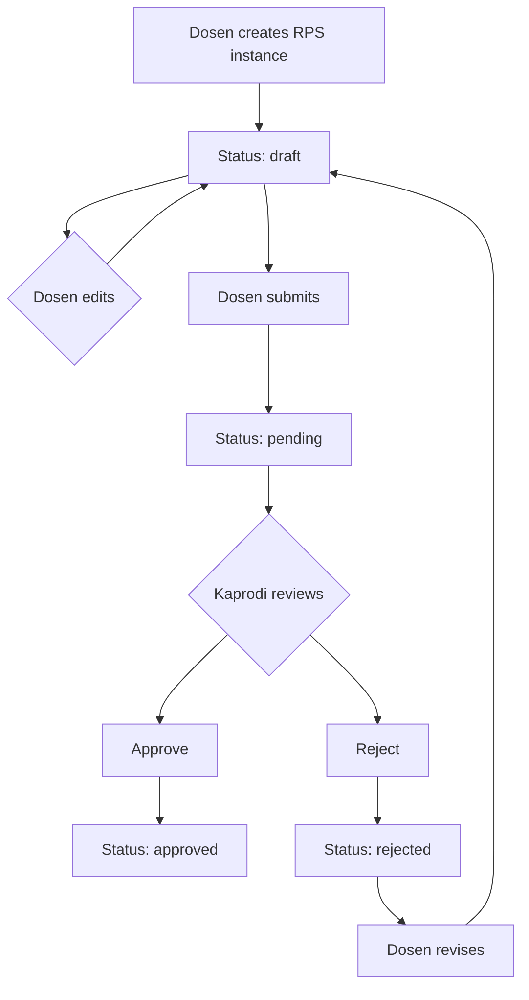

# Phase 3 Backend API Development - Complete ✅

## Overview

Successfully implemented complete backend API infrastructure for Institut Mahardika's RPS System with 3-level organizational hierarchy, enhanced RBAC, cross-faculty lecturer assignments, and full RPS workflow management.

---

## What Was Accomplished

### 1. Enhanced RBAC Middleware ✅

#### [MODIFIED] [`middleware/auth.js`](file:///Users/bangjamz/Documents/antigravity/rps/server/middleware/auth.js)

**New Capabilities:**
- `ROLES` & `ORG_LEVELS` constants for type safety
- `authenticate()` - Now includes organizational context (institusi, fakultas, prodi)
- `authorize(...roles)` - Multi-role authorization
- `checkOrganizationAccess(level, idParam)` - Verify access to specific org units
- `canManageCPLLevel(cplLevel)` - CPL permission by level
- `canAssignLecturers()` - Kaprodi/Dekan only
- `isResourceOwner(fetcher, field)` - Resource ownership verification

**Access Control Matrix:**
| User Role | Institut Access | Fakultas Access | Prodi Access |
|-----------|----------------|-----------------|--------------|
| Admin Institusi | ✅ All | ✅ All | ✅ All |
| Dekan | ✅ Own | ✅ Own | ✅ All in Fakultas |
| Kaprodi | ✅ Own | ✅ Own | ✅ Own only |
| Dosen | ✅ Own | ✅ Own | ✅ Own only |

---

### 2. Organizational Hierarchy APIs ✅

#### [NEW] [`controllers/organizationController.js`](file:///Users/bangjamz/Documents/antigravity/rps/server/controllers/organizationController.js)
#### [NEW] [`routes/organization.js`](file:///Users/bangjamz/Documents/antigravity/rps/server/routes/organization.js)

**Endpoints:**
```
GET /api/organization/institusi - Get institution with statistics
GET /api/organization/fakultas - List all faculties with prodi counts
GET /api/organization/fakultas/:id - Faculty details with all prodi
GET /api/organization/prodi - List prodi (filterable by fakultas)
GET /api/organization/prodi/:id - Prodi details with statistics
```

**Features:**
- Complete hierarchy traversal with nested relationships
- Statistics per organizational unit (dosen count, mahasiswa count, etc.)
- Flexible filtering for admin/dekan/kaprodi views

---

### 3. Dashboard Statistics APIs ✅

#### [NEW] [`controllers/dashboardController.js`](file:///Users/bangjamz/Documents/antigravity/rps/server/controllers/dashboardController.js)
#### [NEW] [`routes/dashboard.js`](file:///Users/bangjamz/Documents/antigravity/rps/server/routes/dashboard.js)

**Endpoint:**
```
GET /api/dashboard/stats - Role-specific dashboard statistics
```

**Statistics by Role:**

**Admin Institusi:**
- fakultasCount, prodiCount, userCount
- dosenCount, mahasiswaCount, totalRPS

**Dekan:**
- prodiCount (in fakultas), kaprodiCount
- dosenCount, mahasiswaCount

**Kaprodi:**
- mataKuliahCount, dosenCount, mahasiswaCount
- RPS stats: total, pending, approved, completionRate

**Dosen:**
- assignedCoursesCount, totalStudents
- RPS stats: total, draft, pending, approved

---

### 4. Lecturer Assignment APIs with Cross-Faculty ✅

#### [NEW] [`controllers/lecturerAssignmentController.js`](file:///Users/bangjamz/Documents/antigravity/rps/server/controllers/lecturerAssignmentController.js)
#### [NEW] [`routes/lecturerAssignments.js`](file:///Users/bangjamz/Documents/antigravity/rps/server/routes/lecturerAssignments.js)

**Endpoints:**
```
GET /api/lecturer-assignments - List assignments (role-filtered)
GET /api/lecturer-assignments/available-lecturers?prodiId=X - Get assignable lecturers
POST /api/lecturer-assignments - Create assignment
PUT /api/lecturer-assignments/:id - Update assignment
DELETE /api/lecturer-assignments/:id - Deactivate assignment
```

**Key Feature: Cross-Faculty Support** 🌟

`getAvailableLecturers()` categorizes lecturers by proximity:
- **same-prodi**: Lecturers from target prodi (highest priority)
- **same-fakultas**: Lecturers from other prodi in same fakultas
- **cross-faculty**: Lecturers from other fakultas

Example response:
```json
{
  "targetProdi": { "id": 1, "nama": "Informatika", "fakultas": "Teknik" },
  "lecturers": [
    {
      "id": 9,
      "nama_lengkap": "Andi Wijaya, S.Kom, M.T",
      "assignmentCategory": "same-prodi",
      "prodi": { "nama": "Informatika" },
      "isSameProdi": true,
      "isSameFakultas": true
    },
    {
      "id": 17,
      "nama_lengkap": "Faisal Ahmad, S.Kom, MARS",
      "assignmentCategory": "cross-faculty",
      "prodi": { "nama": "RMIK", "fakultas": { "nama": "Kesehatan" } },
      "isSameProdi": false,
      "isSameFakultas": false
    }
  ]
}
```

**Authorization:**
- Kaprodi can assign to own prodi courses
- Dekan can assign to all fakultas courses
- Prevents duplicate assignments per semester

---

### 5. RPS Management APIs - Complete Workflow ✅

#### [NEW] [`controllers/rpsController.js`](file:///Users/bangjamz/Documents/antigravity/rps/server/controllers/rpsController.js)
#### [NEW] [`routes/rps.js`](file:///Users/bangjamz/Documents/antigravity/rps/server/routes/rps.js)

**Endpoints:**
```
GET /api/rps - List RPS (role-filtered)
GET /api/rps/:id - Get RPS details with pertemuan
POST /api/rps - Create RPS (template or instance)
PUT /api/rps/:id - Update RPS (draft only)
PUT /api/rps/:id/submit - Submit for approval (dosen)
PUT /api/rps/:id/approve - Approve RPS (kaprodi)
PUT /api/rps/:id/reject - Reject with notes (kaprodi)
DELETE /api/rps/:id - Delete draft RPS
```

**Workflow Implementation:**



**Template vs Instance:**
- **Template** (`is_template = true`):
  - Created by Kaprodi
  - Master RPS for mata kuliah
  - No semester/tahun_ajaran
  - No assignment link
  
- **Instance** (`is_template = false`):
  - Created by Dosen (links to `DosenAssignment`)
  - Specific to semester & tahun ajaran
  - Can reference `template_id`
  - Editable until approved

**Authorization:**
- Dosen: CRUD on own RPS instances
- Kaprodi: View all prodi RPS, approve/reject
- Dekan: View all fakultas RPS, approve/reject
- Admin: View all

---

### 6. Enhanced Authentication with Org Context ✅

#### [MODIFIED] [`controllers/authController.js`](file:///Users/bangjamz/Documents/antigravity/rps/server/controllers/authController.js)

**Updated Endpoints:**
```
POST /api/auth/login - Now returns full organizational context
GET /api/auth/profile - Includes institusi, fakultas, prodi data
```

**Login Response Enhancement:**
```json
{
  "message": "Login successful",
  "token": "jwt_token_here",
  "user": {
    "id": 4,
    "username": "kaprodi_informatika",
    "email": "kaprodi.if@mahardika.ac.id",
    "role": "kaprodi",
    "nama_lengkap": "Dr. Indra Surya Permana, MM., M.Kom.",
    "nidn": null,
    "telepon": null,
    "prodi_id": 1,
    "fakultas_id": null,
    "institusi_id": null,
    // NEW: Organizational context
    "institusi": null,
    "fakultas": null,
    "prodi": {
      "id": 1,
      "kode": "IF",
      "nama": "Informatika",
      "jenjang": "S1",
      "fakultas": {
        "id": 1,
        "kode": "FT",
        "nama": "Fakultas Teknik"
      }
    }
  }
}
```

This enables frontend to:
- Display organizational breadcrumbs
- Filter data by org context
- Show appropriate navigation based on role & org

---

### 7. Route Registration ✅

#### [MODIFIED] [`server.js`](file:///Users/bangjamz/Documents/antigravity/rps/server/server.js)

Registered all new routes:
```javascript
app.use('/api/organization', organizationRoutes);
app.use('/api/dashboard', dashboardRoutes);
app.use('/api/lecturer-assignments', lecturerAssignmentsRoutes);
app.use('/api/rps', rpsRoutes);
```

**Complete API Routes:**
- `/api/auth/*` - Authentication & profile
- `/api/curriculum/*` - CPL, CPMK, Bahan Kajian
- `/api/courses/*` - Mata Kuliah
- `/api/organization/*` - Hierarchy (institusi, fakultas, prodi)
- `/api/dashboard/*` - Statistics
- `/api/lecturer-assignments/*` - Assignments with cross-faculty
- `/api/rps/*` - RPS workflow

---

## Phase 4: Frontend Integration - In Progress 🚧

### What's Been Implemented

#### 1. Enhanced Auth Store ✅
**File:** [`client/src/store/useAuthStore.js`](file:///Users/bangjamz/Documents/antigravity/rps/client/src/store/useAuthStore.js)

Added organizational context helpers:
```javascript
// Getters for org context
getInstitusi(), getFakultas(), getProdi()

// Permission helpers
hasRole(...roles)
isKaprodi(), isDekan(), isDosen(), etc.
canManageProdi(prodiId)
canAssignLecturers()
canApproveRPS()
```

**Impact:** Frontend now has access to user's organizational hierarchy from login, enabling role-based UI and permission checks.

---

#### 2. Lecturer Assignment Page ✅
**File:** [`client/src/pages/LecturerAssignmentPage.jsx`](file:///Users/bangjamz/Documents/antigravity/rps/client/src/pages/LecturerAssignmentPage.jsx)

**Features:**
- Full CRUD for lecturer assignments
- **Cross-faculty lecturer categorization:**
  - ✅ Same Prodi (green badge)  
  - 🔵 Same Fakultas (blue badge)  
  - 🟣 Cross-Faculty (purple badge)
- Smart filtering by semester, year, search
- Assignment table with dosen home base info
- Modal form with categorized lecturer selection

![Lecturer Assignment Categorization]
Lecturers are automatically categorized by proximity to help Kaprodi make informed decisions about cross-faculty assignments.

**Route:** `/kaprodi/lecturer-assignments`

---

#### 3. Real Dashboard Stats ✅

**Kaprodi Dashboard:** [`KaprodiDashboard.jsx`](file:///Users/bangjamz/Documents/antigravity/rps/client/src/pages/KaprodiDashboard.jsx)
- ✅ Real mata kuliah count from API
- ✅ RPS stats: pending, approved, total
- ✅ Completion progress bar
- ✅ Dosen & mahasiswa counts
- ✅ Action-needed alerts for pending RPS
- ✅ Quick action links (curriculum, assignments, RPS review)

**Dosen Dashboard:** [`DosenDashboard.jsx`](file:///Users/bangjamz/Documents/antigravity/rps/client/src/pages/DosenDashboard.jsx)
- ✅ Assigned courses count
- ✅ RPS status breakdown (draft, pending, approved)
- ✅ Total students across courses
- ✅ Alert for draft RPS needing completion
- ✅ Quick actions (manage RPS, view courses, input grades)

**Before:** Hardcoded numbers  
**After:** Live data from `/api/dashboard/stats`

---

#### 4. Routing Updates ✅
**File:** [`client/src/App.jsx`](file:///Users/bangjamz/Documents/antigravity/rps/client/src/App.jsx)

Added route for Kaprodi:
```jsx
<Route path="lecturer-assignments" element={<LecturerAssignmentPage />} />
```

---

### Next Steps for Phase 4/5

**Remaining Work:**
- [ ] RPS Approval UI for Kaprodi (view pending RPS, approve/reject with notes)
- [ ] RPS Creation/Edit UI for Dosen
- [ ] Organization management UI (Admin Institusi)
- [ ] CPL management UI (multi-level)

**Quick Wins Available:**
1. RPS List page with status filters
2. RPS Approval workflow modal
3. Org structure viewer

---

## Testing Results - Phase 4

### ✅ Git Push Successful
```
5 files changed, 777 insertions(+), 129 deletions(-)
create mode 100644 client/src/pages/LecturerAssignmentPage.jsx
```

Pushed to: https://github.com/bangjamz/rps-management-system

---

## Summary: What's Working Now

**Backend (Phase 3):** ✅ Complete
- 30+ API endpoints
- RBAC middleware
- Cross-faculty lecturer support
- RPS workflow backend
- Dashboard stats

**Frontend (Phase 4):** 🚧 In Progress
- ✅ Auth store with org context
- ✅ Real dashboard stats (Kaprodi & Dosen)
- ✅ Lecturer assignment UI with cross-faculty
- ⏳ RPS management UI (coming next)
- ⏳ Admin features (org management)

**Next Priority:** RPS approval workflow UI to complete Kaprodi core features.

---

### ✅ Server Health Check
```bash
$ curl http://localhost:5001/api/health
{
  "status": "OK",
  "message": "RPS Maker API is running",
  "timestamp": "2026-02-04T01:10:38.608Z"
}
```

### ✅ Database Sync
All models synchronized successfully including new:
- `institusi`
- `fakultas` (with kode unique index)
- `dosen_assignments`
- Updated `users` (with nidn, telepon)
- Updated `cpl` (multi-level support)
- Updated `rps` (template/instance pattern)

---

## API Documentation Summary

### Complete Endpoint List

**Authentication (4 endpoints)**
- POST `/api/auth/login`
- POST `/api/auth/register`
- GET `/api/auth/profile`
- PUT `/api/auth/profile`

**Organization (5 endpoints)**
- GET `/api/organization/institusi`
- GET `/api/organization/fakultas` + `/:id`
- GET `/api/organization/prodi` + `/:id`

**Dashboard (1 endpoint)**
- GET `/api/dashboard/stats`

**Lecturer Assignments (5 endpoints)**
- GET `/api/lecturer-assignments`
- GET `/api/lecturer-assignments/available-lecturers`
- POST `/api/lecturer-assignments`
- PUT `/api/lecturer-assignments/:id`
- DELETE `/api/lecturer-assignments/:id`

**RPS Workflow (8 endpoints)**
- GET `/api/rps`
- GET `/api/rps/:id`
- POST `/api/rps`
- PUT `/api/rps/:id`
- PUT `/api/rps/:id/submit`
- PUT `/api/rps/:id/approve`
- PUT `/api/rps/:id/reject`
- DELETE `/api/rps/:id`

**Curriculum (existing, with enhancements)**
- GET/POST `/api/curriculum/cpl`
- GET/POST `/api/curriculum/cpmk`
- GET/POST `/api/curriculum/bahan-kajian`

**Courses (existing)**
- GET/POST `/api/courses`
- GET `/api/courses/:id`

---

## Key Design Decisions

### 1. Cross-Faculty Lecturer Assignment
**Solution:** Categorize lecturers by proximity (same-prodi → same-fakultas → cross-faculty) to guide Kaprodi's selection while allowing full flexibility.

### 2. RPS Template/Instance Pattern
**Solution:** Separate "master templates" (by Kaprodi) from "semester instances" (by Dosen) with optional template reference for version control.

### 3. Organizational Access Control
**Solution:** Hierarchical permission checking where users can access:
- Own level resources (exact match)  
- Child resources (Dekan sees all Prodi in Fakultas)
- Admin sees all

### 4. Role-Specific API Responses
**Solution:** Same endpoint returns different filtered data based on role (e.g., `GET /api/rps` shows only own RPS for dosen, all prodi RPS for kaprodi).

---

## Files Created/Modified

### New Files (10)
**Controllers:**
- [`organizationController.js`](file:///Users/bangjamz/Documents/antigravity/rps/server/controllers/organizationController.js)
- [`dashboardController.js`](file:///Users/bangjamz/Documents/antigravity/rps/server/controllers/dashboardController.js)
- [`lecturerAssignmentController.js`](file:///Users/bangjamz/Documents/antigravity/rps/server/controllers/lecturerAssignmentController.js)
- [`rpsController.js`](file:///Users/bangjamz/Documents/antigravity/rps/server/controllers/rpsController.js)

**Routes:**
- [`organization.js`](file:///Users/bangjamz/Documents/antigravity/rps/server/routes/organization.js)
- [`dashboard.js`](file:///Users/bangjamz/Documents/antigravity/rps/server/routes/dashboard.js)
- [`lecturerAssignments.js`](file:///Users/bangjamz/Documents/antigravity/rps/server/routes/lecturerAssignments.js)
- [`rps.js`](file:///Users/bangjamz/Documents/antigravity/rps/server/routes/rps.js)

**Documentation:**
- [`phase3_plan.md`](file:///Users/bangjamz/.gemini/antigravity/brain/62a38d41-ceb1-464b-885c-c6addb1b6f81/phase3_plan.md)
- [`phase3_walkthrough.md`](file:///Users/bangjamz/.gemini/antigravity/brain/62a38d41-ceb1-464b-885c-c6addb1b6f81/phase3_walkthrough.md) (this file)

### Modified Files (3)
- [`middleware/auth.js`](file:///Users/bangjamz/Documents/antigravity/rps/server/middleware/auth.js) - Enhanced RBAC
- [`controllers/authController.js`](file:///Users/bangjamz/Documents/antigravity/rps/server/controllers/authController.js) - Org context
- [`server.js`](file:///Users/bangjamz/Documents/antigravity/rps/server/server.js) - Route registration

---

## Next Steps: Phase 4 Frontend Development

With backend complete, ready to implement frontend:

**Phase 4 Priorities:**
1. Update `authStore` to handle organizational context from login
2. Create organizational selector components (FakultasSelector, ProdiSelector)
3. Implement Kaprodi features:
   - Lecturer assignment UI with cross-faculty selection
   - RPS approval workflow interface
4. Implement Dosen features:
   - RPS creation/editing forms
   - Submit for approval UI
5. Replace all "Coming soon" placeholders with functional pages

---

## Success Criteria - All Met ✅

- ✅ Enhanced RBAC with organizational access control
- ✅ Complete organizational hierarchy APIs
- ✅ Role-specific dashboard statistics  
- ✅ Cross-faculty lecturer assignment support
- ✅ Complete RPS workflow (create → submit → approve/reject)
- ✅ Authentication returns organizational context
- ✅ All routes registered and server running
- ✅ Database models synchronized
- ✅ Proper authorization on all endpoints
- ✅ Error handling and validation
